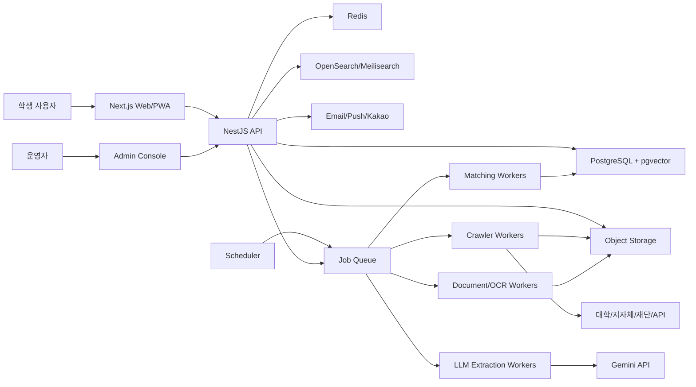
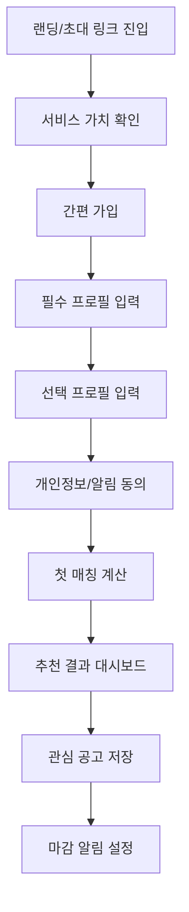
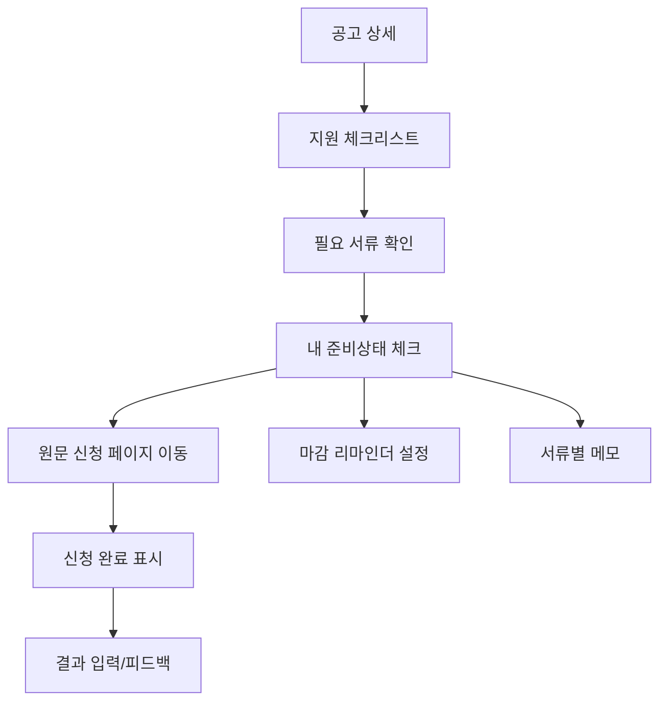
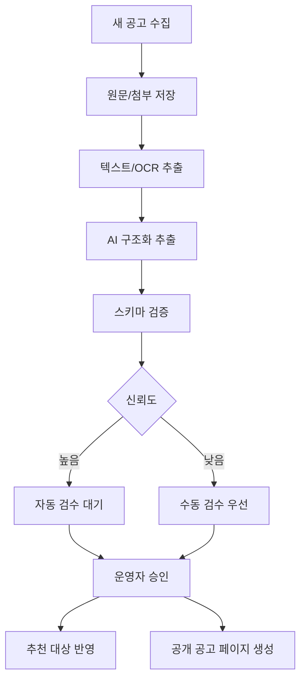
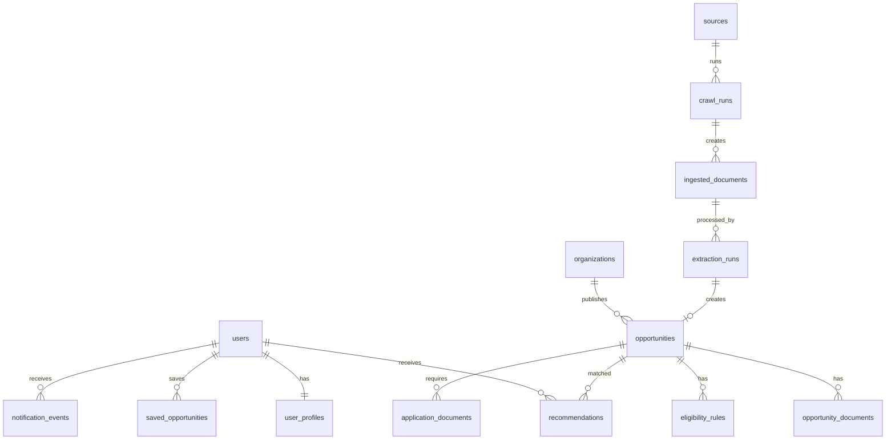
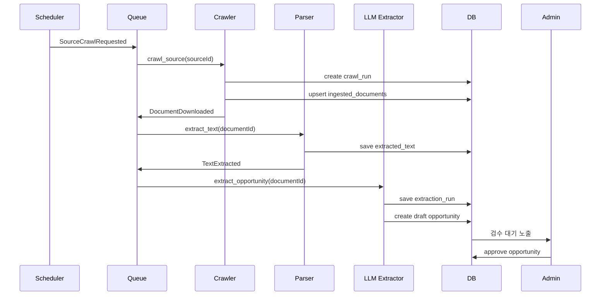

# 오퍼가디언 서비스/기술 설계서

작성일: 2026-05-07  
서비스 한 줄 정의: 내 지역, 내 학교, 내 조건으로 받을 수 있는 장학금, 지원사업, 공모전을 놓치지 않게 해주는 기회 매칭 실행 서비스

---

## 0. 요약

오퍼가디언은 전국 대학생이 흩어진 장학금, 지자체 지원사업, 일부 청년지원사업, 선별된 공모전을 놓치지 않도록 공고를 수집하고, 사용자의 지역/학교/학년/전공/성적/소득구간/특수자격/관심분야/보유역량 조건과 대조해 지원 가능성이 높은 기회를 알려주는 서비스다.

초기 제품은 “전국 모든 공고 완전 자동화”가 아니라 “검수 가능한 범위의 장학금/지원사업 정밀 매칭”으로 시작해야 한다. 가장 현실적인 MVP는 다음 범위다.

- 대상: 국내 대학생, 휴학생, 졸업유예생, 대학원생 일부
- 정보 범위: 대학 장학공지, 지자체 장학재단, 민간 장학재단, 한국장학재단/공공 API, 주요 청년지원사업
- 포함/제한: 공식 원문 URL 기반 공모전은 포함하되, 대형 플랫폼 무단 크롤링과 일반 대외활동 전체 커버리지는 후순위
- 핵심 가치: “몰라서 못 받는 돈”과 “놓쳐서 못 쌓는 포트폴리오”를 줄이는 것
- 핵심 기능: 프로필 기반 추천, 알림센터, 마감 캘린더, 공통 서류 보관함, 지원서류 체크리스트, 신청 상태 관리, 근거 있는 매칭 설명, 관리자 검수

서비스 성공의 핵심은 AI 모델 자체가 아니라 다음 자산을 쌓는 것이다.

- 검수된 공고 데이터베이스
- 장학금 자격요건 표준 스키마
- 사용자 프로필-공고 매칭 로그
- 오탐/누락 신고와 수정 이력
- 학교/지역별 롱테일 공고 수집 커버리지

---

## 1. 구현가능성

### 1.1 결론

구현 가능성은 높다. 다만 공고 수집과 자격요건 판정의 정확도 때문에 “완전 자동”보다 “AI 추출 + 규칙엔진 + 사람 검수 + 사용자 피드백” 구조가 현실적이다.

| 영역 | 가능성 | 난이도 | 판단 |
|---|---:|---:|---|
| 공공 API 연동 | 높음 | 낮음~중간 | 온통청년, 정부24/공공데이터포털 등 API 활용 가능 |
| 대학/재단 게시판 크롤링 | 중간 | 중간~높음 | 사이트별 구조가 달라 어댑터 관리 필요 |
| PDF/HWP/이미지 공고 파싱 | 중간 | 높음 | OCR, 문서 파서, LLM 추출 조합 필요 |
| 자격요건 구조화 | 중간~높음 | 중간 | LLM structured output + 검수 큐로 가능 |
| 사용자 프로필 매칭 | 높음 | 중간 | 규칙엔진과 점수화 모델로 구현 가능 |
| “혜택 총액” 산정 | 중간 | 중간~높음 | 실제 선발금액/중복수혜/등록금성 제한 때문에 보수적 표현 필요 |
| 마감 알림 | 높음 | 낮음 | 푸시/이메일/카카오 알림톡 등 구현 용이 |
| 전국 모든 공고 실시간 커버리지 | 낮음 | 매우 높음 | 초기 목표로 부적합 |
| B2B SaaS/홍보 수익화 | 중간 | 중간 | 학교/지자체/재단 대상 검증 필요 |

### 1.2 외부 환경 근거

- 2025년 기준 국내 고등교육기관 재적학생은 약 301만 명, 고등교육기관은 421개교로 충분한 타겟 풀이 있다.
  - 참고: https://www.kyosu.net/news/articleView.html?idxno=142277
- 온통청년은 중앙부처/지자체 청년정책 3000여 개 통합검색, AI 챗봇, 자가진단, 맞춤형 정책검색을 제공한다.
  - 참고: https://www.korea.kr/news/customizedNewsView.do?newsId=148939880
- 온통청년은 청년정책/청년공간 API를 제공한다.
  - 참고: https://www.youthcenter.go.kr/cmnFooter/openapiIntro/oaiGuide
- 정부24는 보조금/혜택 안내와 공공서비스 Open API를 제공한다.
  - 참고: https://www.gov.kr/openapi
- Gemini API는 PDF 문서 처리와 구조화 출력을 지원한다.
  - PDF 처리: https://ai.google.dev/gemini-api/docs/document-processing
  - 구조화 출력: https://ai.google.dev/gemini-api/docs/structured-output
- 개인정보보호법은 자동화된 결정에 대한 설명 요구, 거부권, 자동화된 결정 기준/절차 공개 의무를 둔다.
  - 참고: https://www.law.go.kr/LSW/lsLinkCommonInfo.do?ancYnChk=&chrClsCd=010202&lsJoLnkSeq=1029334889

### 1.3 가장 실현성 높은 MVP

MVP 목표는 “전국 최고 커버리지”가 아니라 “정확한 매칭 경험”이다.

MVP 범위:

- 지역: 3~5개 광역권 또는 특정 권역부터 시작
- 대학: 20개 내외
- 공고 소스: 100~200개
- 공고 카테고리: 장학금, 생활비 지원, 주거비 지원, 해외연수/교육비 지원, 멘토링/근로성 장학금
- 사용자 프로필: 학교, 캠퍼스, 학년, 전공계열, 거주지, 출신지역, 성적구간, 소득구간, 재학상태, 관심분야, 특수조건 선택
- 추천 결과: 지원가능/조건부가능/확인필요/지원불가
- 알림: 신규 추천, 마감 7일 전, 3일 전, 1일 전, 당일

MVP에서 반드시 들어가야 하는 기능:

- 공고 수집 관리자 화면
- AI 추출 결과 검수 화면
- 사용자 프로필 입력
- 추천 목록
- 추천 근거 설명
- 마감 알림
- 오탐/누락 신고

MVP에서 빼도 되는 기능:

- 완전 자동 신청
- 공모전 전체 커버리지
- 기업 인재 추천
- 복잡한 SNS 커뮤니티
- 금융/마이데이터 직접 연동
- 전국 모든 대학/지자체 커버리지

### 1.4 핵심 리스크

#### 데이터 리스크

공고는 웹페이지, PDF, HWP, 이미지, 첨부파일, 게시판 댓글, 대학 포털 로그인 내부 공지 등으로 흩어져 있다. 특히 대학별 장학공지와 지자체 장학재단은 게시판 구조가 다르고, 첨부파일 중심으로 운영되는 곳이 많다.

대응:

- API 가능한 곳은 API 우선
- 크롤링 가능한 곳은 사이트별 커넥터
- 어려운 사이트는 RSS/사이트맵/검색엔진/수동 등록 병행
- 처음부터 모든 소스를 자동화하지 않고 수집 우선순위 등급화
- 공고별 원문 URL, 첨부파일 해시, 수집 시각, 추출 버전 저장

#### 정확도 리스크

AI가 공고의 자격요건을 잘못 추출하면 사용자에게 잘못된 기회를 추천하거나, 받을 수 있는 기회를 숨길 수 있다. 특히 “부모 주소지”, “공고일 기준 1년 이상 거주”, “직전학기 12학점 이상”, “타 장학금 중복수혜 불가” 같은 조건은 실수하기 쉽다.

대응:

- AI는 최종 판정자가 아니라 추출 보조자로 둔다.
- 자격요건은 JSON 스키마로 추출하고 규칙엔진이 판정한다.
- 낮은 신뢰도 항목은 “확인필요”로 표시한다.
- 초기에는 관리자 검수 후 공개한다.
- 추천 카드에는 반드시 “왜 추천됐는지”와 “확인해야 할 조건”을 보여준다.

#### 법/개인정보 리스크

사용자 프로필에는 학교, 주소지, 소득구간, 성적, 가족상황, 국가보훈/장애/다문화/북한이탈 등 민감하거나 민감에 가까운 정보가 포함될 수 있다.

대응:

- 최소수집 원칙
- 민감조건은 직접 입력 대신 “해당함/해당하지 않음/말하고 싶지 않음” 선택
- 프로필 입력 단계에서 목적별 동의 분리
- 추천 알고리즘 설명 제공
- 자동화된 결정이 아니라 “정보 추천/자가진단 보조”임을 명확히 표시
- 추천 근거와 데이터 처리 방식을 공개
- 계정 삭제/프로필 삭제/알림 해지 기능 제공

#### 사업 리스크

학생은 지불 의사가 높지 않다. 광고를 과도하게 넣으면 신뢰가 떨어진다.

대응:

- 학생용 기본 무료
- 대학/학생처/취업지원센터 대상 SaaS
- 지자체 청년정책/장학재단 홍보 패키지
- 장학재단 모집 홍보와 성과 리포트
- 프리미엄 개인 기능은 보조 수익으로 제한

### 1.5 구현 단계

#### 0단계: 검증용 수동 MVP

기간: 2~4주

- Notion/Airtable/Google Sheet로 100개 공고 수집
- AI로 자격요건 추출 후 수동 검수
- 30~50명 대학생 프로필로 수동 매칭
- 카카오톡/이메일로 추천 발송

검증 목표:

- 사용자가 프로필을 입력할 만큼 문제를 느끼는가
- 추천을 실제로 클릭/신청하는가
- 추천 정확도에 대한 신뢰가 생기는가
- 어떤 조건에서 오탐이 많이 나는가

#### 1단계: 프로덕트 MVP

기간: 8~12주

- 웹앱/모바일 웹
- 사용자 가입/프로필
- 공고 수집 파이프라인
- AI 추출/관리자 검수
- 추천 목록/상세
- 이메일/푸시 알림
- 오탐 신고

#### 2단계: 운영 확장

기간: 3~6개월

- 수집 소스 500~1000개
- 학교별/지역별 커버리지 대시보드
- 크롤러 실패 감지
- 알림 개인화
- 신청서류 체크리스트
- 캘린더 연동
- B2B 관리자 기능

#### 3단계: 플랫폼화

기간: 6~18개월

- 대학/재단 직접 공고 등록
- 지자체/재단 홍보 캠페인
- 장학금 데이터 API
- 정책/장학금 성과 분석 리포트
- 청년지원금, 주거지원, 교육지원으로 확장

---

## 2. 기술스택 선정

### 2.1 기술 선정 원칙

오퍼가디언은 데이터 수집, 문서 처리, 추천, 알림, 검수 운영이 핵심이다. 따라서 기술스택은 다음 기준을 우선한다.

- 빠른 MVP 개발
- 운영자 검수 화면 구현 용이성
- 비동기 작업 처리 안정성
- 크롤링/문서처리/AI 연동 확장성
- 개인정보 보안
- 추천 근거 추적 가능성
- 비용 통제

### 2.2 추천 스택

#### 프론트엔드

- Next.js 15+
- React
- TypeScript
- Tailwind CSS
- shadcn/ui 또는 Radix UI
- TanStack Query
- Zod
- React Hook Form
- PWA 지원

선정 이유:

- 모바일 웹 우선 제품에 적합
- SEO가 필요한 공개 공고 페이지 대응 가능
- 관리자 화면과 사용자 화면을 같은 코드베이스에서 빠르게 구현 가능
- TypeScript/Zod로 API 계약 안정화

대안:

- Flutter: 앱 중심이면 유리하지만 초기 웹/관리자/SEO에는 무거움
- React Native: 앱 푸시가 중요할 때 좋지만 MVP에서는 모바일 웹이 빠름
- Vue/Nuxt: 가능하지만 한국 개발자 채용/생태계는 React/Next 쪽이 유리

#### 백엔드

권장 1안: NestJS + TypeScript  
권장 2안: FastAPI + Python

최종 추천: NestJS 메인 API + Python 워커

구성:

- NestJS: 사용자 API, 관리자 API, 인증, 알림, 권한, 결제/B2B
- Python Worker: 크롤링, 문서 파싱, OCR, LLM 추출, 배치 매칭

선정 이유:

- 제품 API는 타입 안정성과 구조화가 중요한 NestJS가 적합
- 크롤링/문서처리/AI 파이프라인은 Python 생태계가 압도적으로 편함
- 둘을 분리하면 팀 확장과 장애 격리가 쉽다.

#### 데이터베이스

- PostgreSQL 16+
- pgvector
- Redis
- Object Storage(S3 호환)
- OpenSearch 또는 Meilisearch

역할:

- PostgreSQL: 사용자, 공고, 자격요건, 추천, 알림, 감사로그
- pgvector: 공고/자격요건 임베딩 검색, 유사공고 중복 감지
- Redis: 캐시, 세션, 큐 보조, rate limit
- S3: 원문 PDF/HWP/이미지 저장
- OpenSearch/Meilisearch: 공고 전문검색

#### 비동기 처리

초기:

- BullMQ + Redis
- Python 워커는 Celery/RQ 또는 자체 queue consumer

확장:

- Temporal
- Kafka 또는 Redpanda

초기에는 BullMQ/Redis로 충분하다. 크롤링/LLM/OCR 작업은 실패/재시도/지연 실행이 중요하므로 큐 기반이어야 한다.

#### AI/문서 처리

- Gemini API: PDF/이미지 공고 이해, 자격요건 추출
- OpenAI 또는 Gemini 임베딩: 유사공고 탐지/검색
- Tesseract OCR 또는 Google Cloud Vision/Document AI: 이미지 OCR 보조
- pdfplumber/PyMuPDF: PDF 텍스트 추출
- Playwright: 동적 페이지 수집
- BeautifulSoup/lxml/readability: HTML 파싱
- HWP 처리: hwp5txt, pyhwp, LibreOffice 변환, 또는 전용 변환 서비스 검토

문서 처리 원칙:

1. 원문 저장
2. 텍스트 추출
3. OCR 필요 여부 판단
4. AI 구조화 추출
5. 스키마 검증
6. 관리자 검수
7. 공개/추천 반영

#### 인프라

MVP:

- Vercel 또는 Cloudflare Pages: 프론트엔드
- AWS ECS/Fargate 또는 Render/Fly.io: API/워커
- RDS PostgreSQL
- ElastiCache Redis
- S3
- CloudWatch/Sentry

한국 사용자 중심이면:

- AWS ap-northeast-2(서울)
- Naver Cloud Platform 또는 Kakao Cloud 검토 가능

확장:

- Kubernetes는 초기에는 과함
- 데이터 파이프라인이 커지면 ECS + Step Functions 또는 Temporal 권장

#### 인증

MVP:

- 이메일 OTP
- 카카오 로그인
- 네이버 로그인
- Apple 로그인은 앱 출시 시 추가

권장:

- Auth.js/NextAuth 또는 자체 NestJS Auth
- JWT Access Token + Refresh Token
- 민감정보 수정 시 재인증

#### 알림

MVP:

- 이메일
- 웹 푸시(PWA)
- 카카오 알림톡은 비용/심사 후 도입

확장:

- 앱 푸시(FCM/APNs)
- SMS는 비용이 높아 핵심 알림에만 사용
- 알림 피로도 제어 필수

#### 모니터링

- Sentry: 프론트/백엔드 에러
- OpenTelemetry: 트레이싱
- Prometheus/Grafana 또는 CloudWatch: 시스템 지표
- 크롤러 성공률/실패율 대시보드
- AI 추출 신뢰도/검수 반려율 대시보드

### 2.3 스택 구성도



---

## 3. 사용흐름 점검

### 3.1 주요 사용자 유형

#### 학생 사용자

목표:

- 내가 신청할 수 있는 장학금/지원사업 찾기
- 마감 놓치지 않기
- 내가 왜 대상인지 이해하기
- 필요한 서류 확인하기

불안:

- 개인정보를 많이 입력해도 되는지
- 추천이 정확한지
- 실제로 신청 가능한지
- 중복수혜 문제가 없는지

#### 운영자

목표:

- 공고 수집 상태 확인
- AI 추출 결과 검수
- 오류/신고 처리
- 소스별 커버리지 관리

불안:

- AI가 잘못 추출한 공고가 공개되는 것
- 마감 지난 공고가 추천되는 것
- 개인정보 이슈

#### 기관/재단 담당자

목표:

- 장학금/지원사업을 적합한 학생에게 알리기
- 신청자 수와 적합도를 높이기
- 홍보 성과 확인하기

불안:

- 허수 신청자가 늘어나는 것
- 공고가 잘못 전달되는 것
- 민감한 선발 기준이 왜곡되는 것

### 3.2 신규 사용자 온보딩 흐름



필수 프로필:

- 학교
- 재학상태
- 학년/학기
- 전공계열
- 거주지 시/군/구
- 출신지역 시/군/구
- 관심 카테고리

선택 프로필:

- 직전학기 학점/백분위 구간
- 소득구간
- 등록금성 장학금 수혜 여부
- 생활비성 장학금 수혜 여부
- 국가장학금 신청 여부
- 가족/우대조건
- 어학/자격증
- 활동경험

민감할 수 있는 항목은 절대 강제하지 않는다. 추천 정확도 개선을 위한 선택 입력임을 명확히 보여준다.

### 3.3 추천 결과 사용 흐름

추천 목록에서 사용자는 다음 행동을 한다.

- 추천 이유 확인
- 신청 가능성 점수 확인
- 조건부 확인 사항 확인
- 필요 서류 확인
- 원문 공고 보기
- 관심 저장
- 신청 준비 상태 체크
- 알림 받기
- 추천 오류 신고

추천 상태:

- 지원가능: 입력한 조건 기준으로 주요 자격요건 충족
- 조건부가능: 일부 조건이 미입력/불명확하지만 지원 가능성 있음
- 확인필요: 공고 해석이 어렵거나 기관 확인 필요
- 지원불가: 명확한 필수조건 미충족
- 마감임박: 마감 3일 이내
- 마감: 접수 종료

### 3.4 지원 준비 흐름



지원 체크리스트 예시:

- 신청서
- 재학증명서
- 성적증명서
- 주민등록초본
- 가족관계증명서
- 소득구간 확인서
- 추천서
- 자기소개서
- 개인정보 수집 동의서
- 통장사본

### 3.5 알림 흐름

알림 종류:

- 신규 추천
- 매칭 점수 상승
- 마감 7일 전
- 마감 3일 전
- 마감 1일 전
- 오늘 마감
- 저장한 공고 변경
- 추가 서류 확인
- 유사 공고 등장

알림 피로도 제어:

- 하루 최대 알림 수 제한
- 중요도 기반 묶음 알림
- 야간 발송 제한
- 카테고리별 알림 설정
- 마감 임박 고가치 공고만 즉시 알림

알림 문구 원칙:

- 과장 금지
- 불안 조장 최소화
- “놓치면 200만원 손실” 같은 표현은 A/B 테스트 전 신중히 사용
- “지원 가능성이 높은 200만원 장학금이 3일 뒤 마감돼요”처럼 보수적 표현

### 3.6 운영자 검수 흐름



운영자 검수 항목:

- 공고명
- 기관명
- 접수기간
- 지원금액
- 지급유형
- 대상 학년
- 학교/전공/지역 제한
- 성적 조건
- 소득 조건
- 중복수혜 조건
- 필요서류
- 신청방법
- 원문 링크
- AI 추출 근거
- 신뢰도

---

## 4. 화면설계

### 4.1 정보구조

사용자 앱:

- 홈 대시보드
- 추천 기회
- 공고 상세
- 관심/저장
- 신청 체크리스트
- 내 프로필
- 알림 설정
- 신고/피드백

운영자 앱:

- 운영 대시보드
- 공고 수집 소스
- 수집된 원문
- AI 추출 검수
- 공고 관리
- 추천/매칭 로그
- 사용자 신고
- 알림 캠페인
- 기관/학교 관리

B2B 기관 앱:

- 기관 대시보드
- 공고 등록
- 공고 성과
- 신청 전환 리포트
- 타겟 조건 설정
- 문의 관리

### 4.2 사용자 홈 대시보드

목적:

- 사용자가 지금 받을 가능성이 있는 기회를 즉시 이해한다.
- 마감이 가까운 기회를 놓치지 않게 한다.

주요 구성:

- 현재 추천 기회 수
- 예상 지원 가능 금액
- 이번 주 마감 공고
- 내 조건에서 강한 매칭 카테고리
- 프로필 완성도
- 신규 추천 카드

문구 예시:

- “지금 조건으로 지원 가능성이 높은 기회 12개”
- “확인 필요 조건을 입력하면 5개를 더 판정할 수 있어요”
- “3일 안에 마감되는 장학금 2개”

주의:

- “무조건 받을 수 있는 금액”처럼 보이면 안 된다.
- “예상 지원 가능 금액”과 “확정 수혜 금액”을 명확히 구분한다.

와이어프레임:

```text
┌──────────────────────────────┐
│ 오퍼가디언                   │
│ [알림] [프로필]              │
├──────────────────────────────┤
│ 지원 가능성이 높은 기회       │
│ 12개                         │
│ 예상 지원 가능 금액 8,400,000원│
│ * 실제 선발/중복수혜에 따라 달라질 수 있음 │
├──────────────────────────────┤
│ 이번 주 마감                 │
│ [D-1] 은평구민 장학생 200만원 │
│ [D-3] 지역인재 생활비 장학금  │
├──────────────────────────────┤
│ 추천 카드                    │
│ 92% 매칭 / 지원가능          │
│ 충남평생교육진흥원 재능키움   │
│ 왜 추천됐나요?               │
└──────────────────────────────┘
```

### 4.3 추천 목록 화면

필터:

- 마감순
- 매칭높은순
- 금액높은순
- 신규순
- 내 지역
- 내 학교
- 생활비성
- 등록금성
- 중복수혜 가능
- 서류 간단
- 온라인 신청 가능

카드 정보:

- 공고명
- 기관명
- 지원금액
- 마감일/D-day
- 매칭 상태
- 핵심 추천 이유 2~3개
- 확인 필요 조건
- 저장 버튼

상태 배지:

- 지원가능
- 조건부가능
- 확인필요
- 마감임박
- 생활비
- 등록금
- 지역제한
- 학교추천필요

### 4.4 공고 상세 화면

상단:

- 공고명
- 기관명
- 마감 D-day
- 지원금액
- 신청 버튼/원문 보기
- 저장/알림 버튼

매칭 설명:

- 충족한 조건
- 확인 필요한 조건
- 불일치 조건
- AI/시스템 판단 근거

공고 요약:

- 대상
- 지원내용
- 신청기간
- 신청방법
- 제출서류
- 선발기준
- 중복수혜
- 문의처

근거 영역:

- 원문에서 추출된 문장
- 첨부파일명
- 추출일
- 검수 상태

주의문:

- “오퍼가디언의 추천은 공고 원문을 바탕으로 한 자가진단 보조 정보입니다. 최종 자격과 선발 여부는 기관 공고 및 심사에 따릅니다.”

### 4.5 프로필 입력 화면

설계 원칙:

- 처음부터 긴 양식을 보여주지 않는다.
- 필수/선택을 분리한다.
- 민감한 항목은 스킵 가능하게 한다.
- 입력할수록 추천 정확도가 올라가는 것을 보여준다.

단계:

1. 학교/재학정보
2. 지역정보
3. 학업정보
4. 경제/소득정보
5. 우대조건
6. 관심분야/알림

프로필 완성도 예시:

- 기본 추천 가능: 45%
- 지역 장학금 정확도 향상: 거주기간 입력 필요
- 성적 장학금 정확도 향상: 직전학기 성적 입력 필요
- 소득연계 장학금 정확도 향상: 소득구간 입력 필요

### 4.6 신청 체크리스트 화면

목적:

- 사용자가 공고를 저장한 뒤 실제 신청까지 가도록 돕는다.

기능:

- 서류별 체크
- 서류 발급처 링크
- 개인 메모
- 제출 마감 알림
- 신청 완료 표시
- 결과 입력

체크리스트 예시:

```text
은평구민 장학생 신청 준비

[ ] 신청서 작성
[ ] 재학증명서
[ ] 성적증명서
[ ] 주민등록초본
[ ] 가족관계증명서
[ ] 추천서

마감: 2026-05-11 18:00
알림: 3일 전, 1일 전, 당일 오전
```

### 4.7 관리자 대시보드

핵심 지표:

- 오늘 수집된 공고
- 검수 대기 공고
- 크롤러 실패 소스
- 마감 임박 미검수 공고
- AI 추출 실패율
- 사용자 신고 수
- 추천 클릭률

운영 액션:

- 공고 승인/반려
- 추출값 수정
- 중복 병합
- 소스 비활성화
- 사용자 신고 처리
- 알림 재발송

### 4.8 AI 추출 검수 화면

좌측:

- 원문 HTML/PDF 뷰어
- 추출 근거 하이라이트

우측:

- 구조화 필드
- 신뢰도
- 스키마 오류
- 저장/승인/반려

중요 기능:

- 원문 문장과 필드 연결
- 수정 이력 저장
- 동일 패턴 재학습/룰 저장
- 필수 필드 누락 경고

---

## 5. API 설계

### 5.1 API 설계 원칙

- REST API 우선, 내부 비동기 이벤트 병행
- OpenAPI 스펙 자동 생성
- 모든 주요 쓰기 작업은 감사로그 저장
- 추천/매칭 결과는 설명 가능해야 함
- 개인정보 관련 API는 권한/목적 제한
- 관리자 API와 사용자 API 분리

### 5.2 인증 API

#### POST /v1/auth/social/kakao

카카오 로그인.

Request:

```json
{
  "authorizationCode": "string",
  "redirectUri": "string"
}
```

Response:

```json
{
  "accessToken": "string",
  "refreshToken": "string",
  "user": {
    "id": "usr_123",
    "email": "user@example.com",
    "name": "홍길동",
    "onboardingStatus": "PROFILE_REQUIRED"
  }
}
```

#### POST /v1/auth/refresh

Access token 갱신.

#### POST /v1/auth/logout

로그아웃.

#### DELETE /v1/auth/me

계정 삭제. 개인정보 삭제/익명화 정책에 따라 처리.

### 5.3 사용자 프로필 API

#### GET /v1/me/profile

내 프로필 조회.

Response:

```json
{
  "userId": "usr_123",
  "completionRate": 72,
  "education": {
    "schoolId": "sch_001",
    "schoolName": "한국대학교",
    "campus": "본교",
    "status": "ENROLLED",
    "grade": 3,
    "semester": 1,
    "majorName": "컴퓨터공학과",
    "majorCategory": "ENGINEERING"
  },
  "region": {
    "currentResidence": "서울특별시 마포구",
    "registeredResidence": "서울특별시 마포구",
    "hometown": "충청남도 천안시",
    "residenceMonths": 18
  },
  "academic": {
    "gpaScale": 4.5,
    "gpa": 3.8,
    "creditCompletedLastSemester": 18
  },
  "financial": {
    "incomeBracket": 3,
    "nationalScholarshipApplied": true
  },
  "specialConditions": [
    "MULTICULTURAL_FAMILY",
    "FIRST_GENERATION_COLLEGE"
  ],
  "notificationPreferences": {
    "email": true,
    "webPush": true,
    "deadlineDays": [7, 3, 1]
  }
}
```

#### PUT /v1/me/profile

프로필 전체 수정.

#### PATCH /v1/me/profile

프로필 일부 수정.

#### POST /v1/me/profile/consents

목적별 동의 저장.

### 5.4 공고 API

#### GET /v1/opportunities

공고 검색.

Query:

- category
- region
- schoolId
- status
- deadlineFrom
- deadlineTo
- sort
- page
- limit

Response:

```json
{
  "items": [
    {
      "id": "opp_123",
      "title": "2026년 상반기 지역인재 장학생 선발",
      "organizationName": "마포인재육성장학재단",
      "category": "SCHOLARSHIP",
      "benefitType": "LIVING_EXPENSE",
      "amountText": "최대 200만원",
      "amountMin": 1000000,
      "amountMax": 2000000,
      "applicationStartAt": "2026-05-01T00:00:00+09:00",
      "applicationEndAt": "2026-05-20T18:00:00+09:00",
      "deadlineDday": 13,
      "sourceUrl": "https://example.org/notice/123",
      "verificationStatus": "VERIFIED"
    }
  ],
  "page": 1,
  "limit": 20,
  "total": 128
}
```

#### GET /v1/opportunities/{id}

공고 상세.

Response:

```json
{
  "id": "opp_123",
  "title": "2026년 상반기 지역인재 장학생 선발",
  "summary": "마포구 거주 대학생 대상 생활비 장학금",
  "organization": {
    "id": "org_123",
    "name": "마포인재육성장학재단",
    "type": "LOCAL_FOUNDATION"
  },
  "category": "SCHOLARSHIP",
  "benefit": {
    "type": "LIVING_EXPENSE",
    "amountText": "최대 200만원",
    "amountMin": 1000000,
    "amountMax": 2000000,
    "currency": "KRW"
  },
  "eligibility": {
    "educationStatus": ["ENROLLED"],
    "schoolTypes": ["UNIVERSITY", "COLLEGE"],
    "regions": [
      {
        "type": "REGISTERED_RESIDENCE",
        "code": "11440",
        "name": "서울특별시 마포구",
        "minMonths": 6,
        "referenceDate": "NOTICE_DATE"
      }
    ],
    "minGpa": null,
    "incomeBrackets": null,
    "majorCategories": [],
    "specialConditions": []
  },
  "documents": [
    {
      "name": "재학증명서",
      "required": true
    },
    {
      "name": "주민등록초본",
      "required": true
    }
  ],
  "source": {
    "url": "https://example.org/notice/123",
    "attachments": [
      {
        "fileName": "선발공고.pdf",
        "url": "https://example.org/files/notice.pdf"
      }
    ],
    "collectedAt": "2026-05-07T10:00:00+09:00",
    "lastCheckedAt": "2026-05-07T12:00:00+09:00"
  },
  "verificationStatus": "VERIFIED",
  "disclaimer": "최종 자격 및 선발 여부는 기관 공고와 심사에 따릅니다."
}
```

### 5.5 추천/매칭 API

#### GET /v1/me/recommendations

내 추천 목록.

Query:

- status
- sort
- category
- minAmount
- deadlineWithinDays

Response:

```json
{
  "items": [
    {
      "recommendationId": "rec_123",
      "opportunityId": "opp_123",
      "title": "2026년 상반기 지역인재 장학생 선발",
      "organizationName": "마포인재육성장학재단",
      "matchStatus": "ELIGIBLE",
      "matchScore": 92,
      "confidence": 0.87,
      "amountMax": 2000000,
      "deadlineDday": 3,
      "reasons": [
        "현재 거주지가 마포구로 공고의 지역 조건과 일치합니다.",
        "재학상태가 대학 재학생 조건과 일치합니다."
      ],
      "unknowns": [
        "공고일 기준 6개월 이상 거주 여부를 확인해야 합니다."
      ],
      "warnings": [
        "타 등록금성 장학금과 중복수혜 제한이 있을 수 있습니다."
      ]
    }
  ],
  "summary": {
    "eligibleCount": 8,
    "conditionalCount": 5,
    "estimatedAmountMax": 8400000
  }
}
```

#### GET /v1/me/recommendations/{id}

추천 상세.

#### POST /v1/me/recommendations/recalculate

프로필 변경 후 매칭 재계산 요청.

Response:

```json
{
  "jobId": "job_123",
  "status": "QUEUED"
}
```

### 5.6 저장/체크리스트 API

#### POST /v1/me/saved-opportunities

공고 저장.

#### GET /v1/me/saved-opportunities

저장 목록.

#### DELETE /v1/me/saved-opportunities/{opportunityId}

저장 해제.

#### GET /v1/me/applications/{opportunityId}/checklist

신청 체크리스트 조회.

#### PATCH /v1/me/applications/{opportunityId}/checklist/{itemId}

체크리스트 항목 수정.

#### POST /v1/me/applications/{opportunityId}/mark-applied

신청 완료 표시.

### 5.7 알림 API

#### GET /v1/me/notifications

알림 목록.

#### PATCH /v1/me/notifications/{id}/read

읽음 처리.

#### PUT /v1/me/notification-preferences

알림 설정.

### 5.8 신고/피드백 API

#### POST /v1/opportunities/{id}/reports

공고 오류 신고.

Request:

```json
{
  "type": "WRONG_ELIGIBILITY",
  "message": "거주 조건이 실제 공고와 다르게 표시되어 있습니다.",
  "evidenceUrl": "https://example.org/notice/123"
}
```

#### POST /v1/recommendations/{id}/feedback

추천 피드백.

Request:

```json
{
  "feedback": "NOT_RELEVANT",
  "reason": "이미 마감된 공고입니다."
}
```

### 5.9 관리자 API

#### GET /v1/admin/sources

수집 소스 목록.

#### POST /v1/admin/sources

수집 소스 등록.

#### POST /v1/admin/sources/{id}/run

수동 수집 실행.

#### GET /v1/admin/ingested-documents

수집 원문 목록.

#### GET /v1/admin/extraction-tasks

AI 추출 검수 작업 목록.

#### PATCH /v1/admin/opportunities/{id}

공고 수정.

#### POST /v1/admin/opportunities/{id}/approve

공고 승인.

#### POST /v1/admin/opportunities/{id}/reject

공고 반려.

#### GET /v1/admin/reports

사용자 신고 목록.

### 5.10 내부 이벤트

주요 이벤트:

- SourceCrawlRequested
- SourceCrawlCompleted
- DocumentDownloaded
- DocumentTextExtracted
- OpportunityExtractionCompleted
- OpportunityApproved
- UserProfileUpdated
- MatchCalculationRequested
- RecommendationCreated
- DeadlineReminderScheduled
- NotificationSent
- UserFeedbackReceived

이벤트 예시:

```json
{
  "eventId": "evt_123",
  "type": "OpportunityApproved",
  "occurredAt": "2026-05-07T12:00:00+09:00",
  "payload": {
    "opportunityId": "opp_123",
    "approvedBy": "admin_001",
    "extractionVersion": "ext_456"
  }
}
```

---

## 6. 데이터 설계

### 6.1 핵심 엔티티



### 6.2 사용자 테이블

#### users

| 컬럼 | 타입 | 설명 |
|---|---|---|
| id | uuid | 사용자 ID |
| email | varchar | 이메일 |
| phone_hash | varchar | 휴대폰 해시 |
| name | varchar | 이름 |
| provider | varchar | kakao/naver/email |
| provider_user_id | varchar | 소셜 ID |
| role | varchar | USER/ADMIN/ORG_ADMIN |
| status | varchar | ACTIVE/DELETED/SUSPENDED |
| created_at | timestamptz | 생성일 |
| updated_at | timestamptz | 수정일 |
| deleted_at | timestamptz | 삭제일 |

#### user_profiles

| 컬럼 | 타입 | 설명 |
|---|---|---|
| id | uuid | 프로필 ID |
| user_id | uuid | 사용자 ID |
| school_id | uuid | 학교 |
| campus | varchar | 캠퍼스 |
| education_status | varchar | ENROLLED/LEAVE/GRADUATED/DEFERRED |
| grade | int | 학년 |
| semester | int | 학기 |
| major_name | varchar | 전공명 |
| major_category | varchar | 전공계열 |
| current_region_code | varchar | 실거주지 |
| registered_region_code | varchar | 주민등록지 |
| hometown_region_code | varchar | 출신지역 |
| residence_months | int | 거주기간 |
| gpa | numeric | 학점 |
| gpa_scale | numeric | 학점 만점 |
| last_semester_credits | int | 직전학기 이수학점 |
| income_bracket | int | 소득구간 |
| national_scholarship_applied | boolean | 국가장학금 신청 여부 |
| profile_confidence | numeric | 프로필 완성도 |
| created_at | timestamptz | 생성일 |
| updated_at | timestamptz | 수정일 |

#### user_special_conditions

| 컬럼 | 타입 | 설명 |
|---|---|---|
| user_id | uuid | 사용자 ID |
| condition_code | varchar | 우대조건 코드 |
| answer | varchar | YES/NO/UNKNOWN/PREFER_NOT_TO_SAY |
| verified | boolean | 검증 여부 |
| updated_at | timestamptz | 수정일 |

우대조건 예시:

- LOW_INCOME
- DISABILITY
- NATIONAL_MERIT
- MULTICULTURAL_FAMILY
- NORTH_KOREAN_DEFECTOR
- SINGLE_PARENT_FAMILY
- FIRST_GENERATION_COLLEGE
- RURAL_AREA
- LOCAL_TALENT
- OVERSEAS_KOREAN

민감성이 높은 조건은 선택 입력으로 유지하고, 추천 과정에서 “조건 입력 시 더 정확해짐”만 표시한다.

### 6.3 기관/학교/지역 테이블

#### organizations

| 컬럼 | 타입 | 설명 |
|---|---|---|
| id | uuid | 기관 ID |
| name | varchar | 기관명 |
| type | varchar | UNIVERSITY/LOCAL_GOV/FOUNDATION/COMPANY/PUBLIC |
| region_code | varchar | 지역 |
| website_url | text | 홈페이지 |
| contact_phone | varchar | 문의처 |
| contact_email | varchar | 이메일 |
| status | varchar | ACTIVE/INACTIVE |

#### schools

| 컬럼 | 타입 | 설명 |
|---|---|---|
| id | uuid | 학교 ID |
| name | varchar | 학교명 |
| type | varchar | UNIVERSITY/COLLEGE/GRADUATE/ETC |
| region_code | varchar | 본교 지역 |
| aliases | text[] | 별칭 |
| website_url | text | URL |

#### regions

행정구역 코드 테이블.

| 컬럼 | 타입 | 설명 |
|---|---|---|
| code | varchar | 행정구역 코드 |
| name | varchar | 이름 |
| level | int | 시도/시군구/읍면동 |
| parent_code | varchar | 상위 지역 |

### 6.4 공고 테이블

#### opportunities

| 컬럼 | 타입 | 설명 |
|---|---|---|
| id | uuid | 공고 ID |
| organization_id | uuid | 기관 ID |
| title | varchar | 공고명 |
| normalized_title | varchar | 정규화 제목 |
| category | varchar | SCHOLARSHIP/YOUTH_SUPPORT/HOUSING/EDUCATION |
| benefit_type | varchar | TUITION/LIVING_EXPENSE/HOUSING/PROGRAM/PRIZE |
| amount_text | varchar | 원문 금액 |
| amount_min | bigint | 최소 금액 |
| amount_max | bigint | 최대 금액 |
| currency | varchar | KRW/USD |
| application_start_at | timestamptz | 접수 시작 |
| application_end_at | timestamptz | 접수 종료 |
| announcement_at | timestamptz | 공고일 |
| result_announcement_at | timestamptz | 결과 발표일 |
| application_method | varchar | ONLINE/OFFLINE/EMAIL/SCHOOL_RECOMMENDATION |
| source_url | text | 원문 URL |
| source_hash | varchar | 원문 해시 |
| summary | text | 요약 |
| verification_status | varchar | DRAFT/PENDING/VERIFIED/REJECTED/EXPIRED |
| extraction_confidence | numeric | AI 추출 신뢰도 |
| published_at | timestamptz | 공개일 |
| created_at | timestamptz | 생성일 |
| updated_at | timestamptz | 수정일 |

#### opportunity_documents

| 컬럼 | 타입 | 설명 |
|---|---|---|
| id | uuid | 문서 ID |
| opportunity_id | uuid | 공고 ID |
| file_name | varchar | 파일명 |
| file_type | varchar | PDF/HWP/IMAGE/HTML |
| storage_key | text | S3 키 |
| source_url | text | 원본 URL |
| content_hash | varchar | 파일 해시 |
| extracted_text | text | 추출 텍스트 |
| ocr_status | varchar | NOT_NEEDED/PENDING/DONE/FAILED |
| created_at | timestamptz | 생성일 |

#### application_documents

| 컬럼 | 타입 | 설명 |
|---|---|---|
| id | uuid | 서류 ID |
| opportunity_id | uuid | 공고 ID |
| document_type | varchar | 재학증명서 등 표준코드 |
| name | varchar | 원문 서류명 |
| required | boolean | 필수 여부 |
| note | text | 비고 |

### 6.5 자격요건 설계

자격요건은 단순 컬럼만으로 표현하기 어렵다. 다음 두 방식을 혼합한다.

1. 검색/필터용 정규화 컬럼
2. 세부 판정용 룰 JSON

#### eligibility_rules

| 컬럼 | 타입 | 설명 |
|---|---|---|
| id | uuid | 룰 ID |
| opportunity_id | uuid | 공고 ID |
| rule_type | varchar | REGION/GPA/INCOME/SCHOOL/MAJOR/SPECIAL/AGE |
| operator | varchar | IN/EQ/GTE/LTE/BETWEEN/EXISTS |
| field_path | varchar | user.profile.gpa 등 |
| value_json | jsonb | 기준값 |
| required | boolean | 필수 여부 |
| confidence | numeric | 추출 신뢰도 |
| evidence_text | text | 원문 근거 |
| evidence_location | jsonb | 문서/페이지/문장 위치 |
| created_by | varchar | AI/ADMIN/SYSTEM |

룰 예시:

```json
{
  "ruleType": "REGION",
  "fieldPath": "user.profile.registeredRegionCode",
  "operator": "IN_DESCENDANTS",
  "value": {
    "regionCode": "11440",
    "minResidenceMonths": 6,
    "referenceDate": "announcementAt"
  },
  "required": true,
  "evidenceText": "공고일 현재 계속하여 6개월 이상 마포구에 주민등록이 되어 있는 대학생"
}
```

```json
{
  "ruleType": "GPA",
  "fieldPath": "user.profile.gpa",
  "operator": "GTE",
  "value": {
    "gpa": 3.0,
    "scale": 4.5,
    "orPercentile": 80
  },
  "required": true,
  "evidenceText": "직전학기 평점 3.0 이상 또는 백분위 80점 이상"
}
```

### 6.6 추천/매칭 테이블

#### recommendations

| 컬럼 | 타입 | 설명 |
|---|---|---|
| id | uuid | 추천 ID |
| user_id | uuid | 사용자 ID |
| opportunity_id | uuid | 공고 ID |
| match_status | varchar | ELIGIBLE/CONDITIONAL/UNKNOWN/INELIGIBLE |
| match_score | int | 0~100 |
| confidence | numeric | 신뢰도 |
| estimated_amount_min | bigint | 예상 최소 |
| estimated_amount_max | bigint | 예상 최대 |
| reasons_json | jsonb | 추천 이유 |
| unknowns_json | jsonb | 확인 필요 |
| blockers_json | jsonb | 불일치 |
| warnings_json | jsonb | 주의 |
| match_version | varchar | 매칭엔진 버전 |
| calculated_at | timestamptz | 계산 시각 |
| dismissed_at | timestamptz | 숨김 시각 |

#### match_rule_results

| 컬럼 | 타입 | 설명 |
|---|---|---|
| id | uuid | 결과 ID |
| recommendation_id | uuid | 추천 ID |
| eligibility_rule_id | uuid | 룰 ID |
| result | varchar | PASS/FAIL/UNKNOWN |
| reason | text | 설명 |
| user_value_json | jsonb | 사용자 값 |
| expected_value_json | jsonb | 요구 값 |

### 6.7 수집/추출 테이블

#### sources

| 컬럼 | 타입 | 설명 |
|---|---|---|
| id | uuid | 소스 ID |
| name | varchar | 소스명 |
| type | varchar | API/RSS/HTML/PDF_BOARD/MANUAL |
| base_url | text | 기본 URL |
| organization_id | uuid | 기관 |
| crawl_frequency | interval | 수집 주기 |
| priority | int | 우선순위 |
| parser_config | jsonb | 파서 설정 |
| status | varchar | ACTIVE/PAUSED/BROKEN |
| last_success_at | timestamptz | 마지막 성공 |
| last_failure_at | timestamptz | 마지막 실패 |

#### crawl_runs

| 컬럼 | 타입 | 설명 |
|---|---|---|
| id | uuid | 실행 ID |
| source_id | uuid | 소스 ID |
| status | varchar | QUEUED/RUNNING/SUCCESS/FAILED |
| started_at | timestamptz | 시작 |
| ended_at | timestamptz | 종료 |
| found_count | int | 발견 수 |
| new_count | int | 신규 수 |
| changed_count | int | 변경 수 |
| error_message | text | 오류 |

#### extraction_runs

| 컬럼 | 타입 | 설명 |
|---|---|---|
| id | uuid | 추출 ID |
| document_id | uuid | 원문 문서 |
| model_provider | varchar | GEMINI/OPENAI |
| model_name | varchar | 모델명 |
| prompt_version | varchar | 프롬프트 버전 |
| schema_version | varchar | 스키마 버전 |
| input_token_count | int | 입력 토큰 |
| output_token_count | int | 출력 토큰 |
| raw_output | jsonb | 원본 출력 |
| parsed_output | jsonb | 파싱 결과 |
| confidence | numeric | 신뢰도 |
| status | varchar | SUCCESS/FAILED/NEEDS_REVIEW |
| created_at | timestamptz | 생성일 |

### 6.8 알림 테이블

#### notification_events

| 컬럼 | 타입 | 설명 |
|---|---|---|
| id | uuid | 알림 ID |
| user_id | uuid | 사용자 |
| type | varchar | NEW_MATCH/DEADLINE/SAVED_CHANGED |
| channel | varchar | EMAIL/PUSH/KAKAO |
| title | varchar | 제목 |
| body | text | 내용 |
| payload | jsonb | 링크/데이터 |
| scheduled_at | timestamptz | 예약 |
| sent_at | timestamptz | 발송 |
| read_at | timestamptz | 읽음 |
| status | varchar | PENDING/SENT/FAILED/CANCELED |

### 6.9 감사로그

#### audit_logs

| 컬럼 | 타입 | 설명 |
|---|---|---|
| id | uuid | 로그 ID |
| actor_id | uuid | 행위자 |
| actor_type | varchar | USER/ADMIN/SYSTEM |
| action | varchar | PROFILE_UPDATE/OPPORTUNITY_APPROVE 등 |
| target_type | varchar | 대상 타입 |
| target_id | uuid | 대상 ID |
| before_json | jsonb | 변경 전 |
| after_json | jsonb | 변경 후 |
| ip_address | inet | IP |
| user_agent | text | UA |
| created_at | timestamptz | 생성일 |

개인정보/추천 판정 관련 변경은 반드시 감사로그를 남긴다.

---

## 7. 코드 아키텍처 설계

### 7.1 전체 아키텍처

초기에는 모듈형 모놀리스를 추천한다. 사용자 수와 수집 소스가 늘면 워커/검색/알림을 서비스 단위로 분리한다.

추천 구조:

```text
apps/
  web/                 사용자 웹/PWA
  admin/               운영자 콘솔
  api/                 NestJS API
  worker-node/         알림/스케줄/BullMQ
  worker-python/       크롤링/문서처리/AI 추출

packages/
  shared-types/        API 타입, enum, DTO
  ui/                  공통 UI 컴포넌트
  config/              환경설정
  eslint-config/
  tsconfig/

services/
  crawler-connectors/  사이트별 수집 커넥터
  extraction-schemas/  LLM 추출 JSON schema
  matching-engine/     룰 평가 엔진
```

### 7.2 백엔드 모듈

NestJS API 모듈:

```text
src/
  app.module.ts
  auth/
  users/
  profiles/
  opportunities/
  recommendations/
  saved-opportunities/
  applications/
  notifications/
  reports/
  admin/
  organizations/
  sources/
  audit/
  common/
    guards/
    decorators/
    pipes/
    filters/
    interceptors/
  database/
  queue/
```

모듈별 책임:

- auth: 로그인, 토큰, 권한
- profiles: 사용자 프로필, 동의, 민감조건
- opportunities: 공고 조회/검색
- recommendations: 추천 조회/재계산
- applications: 체크리스트/신청 상태
- notifications: 알림 설정/발송 이력
- reports: 오류 신고/피드백
- admin: 관리자 검수/운영
- sources: 수집 소스 관리
- audit: 감사로그

### 7.3 Python 워커 구조

```text
worker-python/
  app/
    main.py
    config.py
    jobs/
      crawl_source.py
      download_document.py
      extract_text.py
      run_ocr.py
      extract_opportunity.py
      deduplicate_opportunity.py
    connectors/
      base.py
      api_connector.py
      html_board_connector.py
      rss_connector.py
      playwright_connector.py
      manual_upload_connector.py
    parsers/
      pdf_parser.py
      hwp_parser.py
      html_parser.py
      image_ocr.py
    llm/
      gemini_client.py
      schemas/
        opportunity_v1.json
      prompts/
        opportunity_extraction_v1.md
    repositories/
      documents.py
      opportunities.py
      sources.py
    observability/
      logging.py
      metrics.py
```

### 7.4 매칭 엔진 구조

매칭 엔진은 LLM 호출 없이 결정론적으로 동작해야 한다.

```text
matching-engine/
  index.ts
  context/
    build-user-context.ts
    build-opportunity-context.ts
  rules/
    region-rule.ts
    school-rule.ts
    major-rule.ts
    gpa-rule.ts
    income-rule.ts
    age-rule.ts
    special-condition-rule.ts
    duplicate-benefit-rule.ts
  scoring/
    score-calculator.ts
    confidence-calculator.ts
  explanations/
    reason-builder.ts
    warning-builder.ts
```

매칭 처리 순서:

1. 사용자 프로필 로드
2. 공고 룰 로드
3. 필수 룰 평가
4. 선택/우대 룰 평가
5. 누락 정보 평가
6. 중복수혜/주의조건 평가
7. 점수 계산
8. 설명 생성
9. 추천 저장

매칭 상태 결정:

```text
if any(requiredRule == FAIL):
  INELIGIBLE
else if any(requiredRule == UNKNOWN):
  CONDITIONAL
else if confidence < threshold:
  UNKNOWN
else:
  ELIGIBLE
```

점수 예시:

- 필수조건 충족: 60점
- 우대조건 충족: 최대 20점
- 마감/금액/사용자 관심: 최대 10점
- 프로필 완성도/신뢰도: 최대 10점
- 누락/주의조건: 감점

### 7.5 공고 수집 파이프라인



### 7.6 프론트엔드 구조

```text
apps/web/
  app/
    page.tsx
    onboarding/
    recommendations/
    opportunities/
    saved/
    profile/
    notifications/
  components/
    recommendation-card.tsx
    opportunity-summary.tsx
    match-explanation.tsx
    deadline-badge.tsx
    profile-form/
  lib/
    api-client.ts
    auth.ts
    query-keys.ts
  stores/
    onboarding-store.ts
```

관리자:

```text
apps/admin/
  app/
    dashboard/
    sources/
    ingested-documents/
    extraction-review/
    opportunities/
    reports/
  components/
    document-viewer.tsx
    extraction-form.tsx
    evidence-highlight.tsx
```

### 7.7 테스트 전략

단위 테스트:

- 매칭 룰
- 점수 계산
- 날짜/D-day
- 금액 파싱
- 지역 코드 판정
- 중복수혜 룰

통합 테스트:

- 프로필 수정 후 추천 재계산
- 공고 승인 후 추천 생성
- 마감 알림 예약
- 신고 접수 후 관리자 처리

E2E 테스트:

- 신규 가입 → 프로필 입력 → 추천 확인 → 저장 → 알림 설정
- 관리자 수집 → AI 추출 → 검수 승인 → 사용자 추천 노출

AI 추출 회귀 테스트:

- 대표 공고 PDF/HWP 샘플 100개
- 기대 JSON 결과 저장
- 모델/프롬프트 변경 시 비교
- 필수 필드 정확도 측정

품질 지표:

- 자격요건 추출 정확도
- 마감일 추출 정확도
- 금액 추출 정확도
- 지원가능 판정 정확도
- false positive rate
- false negative rate
- 관리자 수정률

---

## 8. 기술적 결정사항 점검

### 8.1 LLM을 어디까지 믿을 것인가

결정:

- LLM은 공고 이해/추출/요약에 사용한다.
- 최종 매칭 판정은 규칙엔진이 한다.
- LLM이 생성한 값은 스키마 검증과 관리자 검수를 통과해야 추천에 반영한다.

이유:

- 추천 근거 추적 가능
- 오류 발생 시 수정 가능
- 법/신뢰 리스크 감소
- 비용 예측 가능

### 8.2 처음부터 앱을 만들 것인가

결정:

- MVP는 모바일 웹/PWA로 시작한다.
- 앱은 추천/알림 리텐션이 검증된 후 출시한다.

이유:

- 대학생 유입은 링크 공유/검색/학교 커뮤니티에서 발생할 가능성이 높음
- 앱 설치 장벽을 줄여야 초기 검증이 쉬움
- 관리/배포 비용 절감

### 8.3 개인정보를 얼마나 받을 것인가

결정:

- 추천에 필요한 최소 정보만 단계적으로 받는다.
- 민감조건은 선택값으로 받고 스킵 가능하게 한다.
- 공공마이데이터 직접 연동은 후순위로 둔다.

이유:

- 초기 신뢰 형성이 더 중요함
- 인증/법무/보안 부담을 낮춤
- 입력 부담이 낮아야 가입 전환이 높음

### 8.4 매칭 점수 표현

결정:

- “합격 가능성”이 아니라 “자격요건 매칭도”로 표현한다.
- 점수는 내부적으로 사용하되, 사용자에게는 상태와 근거 중심으로 보여준다.

좋은 표현:

- “주요 자격요건이 일치해요”
- “거주기간만 확인하면 지원 가능성이 높아요”
- “입력한 조건 기준으로는 전공 조건이 맞지 않아요”

피해야 할 표현:

- “합격률 92%”
- “받을 수 있는 금액”
- “무조건 신청 가능”
- “놓치면 손해”

### 8.5 데이터 수집 방식

결정:

- API > RSS/사이트맵 > HTML 게시판 > Playwright > 수동 등록 순으로 처리한다.
- 사이트별 크롤러는 플러그인/커넥터 형태로 관리한다.
- 수집이 어려운 주요 기관은 직접 제휴/등록 도구를 제공한다.

### 8.6 검색 엔진 도입 시점

결정:

- MVP는 PostgreSQL full-text + trigram으로 시작 가능
- 공고가 5만 건 이상이거나 검색 품질 요구가 커지면 OpenSearch/Meilisearch 도입

### 8.7 관리자 검수 범위

결정:

- 초기에는 공개 공고 전체 검수
- 추출 정확도가 충분히 검증된 소스는 자동 승인
- 금액/마감일/지역조건/중복수혜 조건은 높은 신뢰도에서도 샘플링 검수

자동 승인 조건:

- 신뢰도 0.9 이상
- 필수 필드 누락 없음
- 같은 소스에서 최근 30건 오류율 2% 미만
- 마감일/금액/신청방법 검증 통과

### 8.8 중복 공고 처리

문제:

같은 장학금이 기관 사이트, 대학 공지, PDF 첨부, 보도자료에 중복 게시될 수 있다.

결정:

- 원본 기관 공고를 canonical opportunity로 둔다.
- 대학별 전달 공지는 distribution/source로 연결한다.
- 제목 유사도, 기관명, 마감일, 금액, 첨부파일 해시, 임베딩 유사도를 조합해 중복 감지한다.

### 8.9 HWP 처리

문제:

한국 공공/대학 공고는 HWP 첨부가 많다.

결정:

- 1차: LibreOffice 변환 또는 hwp5txt/pyhwp
- 2차: 변환 실패 시 OCR/PDF 변환
- 3차: 실패 문서는 관리자 수동 처리

운영 지표:

- HWP 변환 성공률
- OCR fallback 비율
- 수동 처리 비율

### 8.10 비용 통제

비용 발생 지점:

- LLM 문서 처리
- OCR
- Playwright 크롤링
- 알림톡/SMS
- 검색엔진
- 스토리지

통제 전략:

- 원문 해시 기반 중복 처리
- 변경 없는 문서 재처리 금지
- 텍스트 추출 가능한 PDF는 LLM에 전체 파일 대신 추출 텍스트 사용
- 긴 문서는 섹션 분할
- 저가 모델로 1차 추출, 고가 모델은 실패/불확실 문서에만 사용
- 알림 묶음 발송

### 8.11 보안

필수:

- TLS
- DB 암호화
- Object Storage private bucket
- 민감 프로필 필드 암호화 또는 별도 테이블 분리
- 관리자 MFA
- RBAC
- 감사로그
- 개인정보 다운로드/삭제 기능
- rate limit
- 크롤러와 사용자 API 네트워크 분리

### 8.12 법/정책 UX

필수 문구:

- AI 기반 추천/요약 사용 고지
- 추천은 최종 심사가 아님
- 원문 공고 확인 필요
- 개인정보 수집 목적
- 자동화된 추천 기준 설명
- 삭제/정정/처리정지 요청 방법

### 8.13 장애 대응

주요 장애:

- 크롤러 실패
- LLM API 장애
- OCR 장애
- 알림 발송 실패
- 잘못된 공고 대량 추천

대응:

- 큐 재시도와 DLQ
- LLM provider fallback
- 공고 공개 kill switch
- 알림 캠페인 취소 기능
- 공고별 추천 비활성화 기능
- 관리자 긴급 배너

### 8.14 KPI

제품 KPI:

- 가입 전환율
- 프로필 완성률
- 추천 클릭률
- 저장률
- 원문 신청페이지 클릭률
- 신청 완료 표시율
- 재방문율
- 마감 알림 클릭률

품질 KPI:

- 추천 정확도
- 오탐 신고율
- 누락 신고율
- 관리자 수정률
- AI 추출 필드 정확도
- 마감일 오류율
- 수집 소스 성공률

사업 KPI:

- 활성 학교 수
- 활성 지역 수
- 월간 추천 공고 수
- 기관 문의 수
- 유료 기관 전환율
- 공고 홍보 캠페인 매출

---

## 9. 최종 문서

### 9.1 제품 방향

오퍼가디언은 대학생이 받을 수 있는 장학금과 지원사업을 “찾아보는 서비스”가 아니라 “놓치지 않게 지켜주는 서비스”다. 따라서 검색보다 알림과 매칭이 중심이어야 한다.

초기 카테고리는 장학금에 집중한다. 공모전/대외활동까지 넓히면 기존 강자가 많은 시장에서 차별점이 흐려진다. 반대로 장학금은 자격요건이 복잡하고, 지역/학교/소득/성적/중복수혜 등 개인 조건과의 대조가 필요하므로 AI+규칙엔진의 가치가 분명하다.

### 9.2 핵심 사용자 가치

사용자가 오퍼가디언을 계속 쓰는 이유는 다음이어야 한다.

- 내가 몰랐던 지역/학교 장학금을 발견한다.
- 내가 대상인지 빠르게 이해한다.
- 마감 전에 알림을 받는다.
- 필요한 서류를 놓치지 않는다.
- 추천의 근거를 확인할 수 있어 신뢰할 수 있다.

### 9.3 MVP 기능 목록

필수:

- 회원가입/로그인
- 프로필 입력
- 공고 수집
- AI 자격요건 추출
- 관리자 검수
- 추천 목록
- 추천 상세/근거
- 공고 저장
- 신청 체크리스트
- 마감 알림
- 오류 신고

선택:

- 웹 푸시
- 카카오 알림톡
- 캘린더 연동
- 학교별 랭킹
- 지역별 지도
- 기관 공고 등록

제외:

- 자동 신청
- 합격 가능성 예측
- 기업 인재 추천
- 모든 공모전/대외활동 통합
- 금융 마이데이터 직접 연동

### 9.4 12주 MVP 로드맵

#### 1~2주차: 기획/데이터 검증

- 대상 학교/지역 선정
- 공고 소스 100개 리스트업
- 공고 스키마 확정
- 프로필 스키마 확정
- 대표 공고 50개 수동 수집
- AI 추출 프롬프트 초안

산출물:

- 데이터 사전
- 공고 소스 목록
- 추출 JSON schema
- 매칭 룰 초안

#### 3~4주차: 기반 구축

- Next.js 앱
- NestJS API
- PostgreSQL 스키마
- 인증
- 프로필 API
- 공고 API
- 관리자 기본 화면

산출물:

- 로그인/프로필 입력 가능
- 공고 CRUD 가능
- 관리자 공고 등록 가능

#### 5~6주차: 수집/추출

- API 소스 연동
- HTML 게시판 크롤러
- PDF 텍스트 추출
- Gemini 구조화 추출
- 추출 결과 검수 화면

산출물:

- 공고 자동 수집 20개 소스
- AI 추출 결과 검수 가능
- 승인된 공고 공개 가능

#### 7~8주차: 매칭/추천

- 매칭 엔진
- 추천 계산 배치
- 추천 목록/상세
- 추천 근거
- 저장 기능

산출물:

- 사용자별 추천 생성
- 지원가능/조건부/불가 판정
- 추천 이유 표시

#### 9~10주차: 알림/체크리스트

- 마감 알림 스케줄러
- 이메일 발송
- 웹 푸시 준비
- 신청 체크리스트
- 신청 완료 표시

산출물:

- 저장 공고 마감 알림
- 서류 체크리스트

#### 11~12주차: 베타/품질 개선

- 베타 사용자 100~300명 모집
- 추천 정확도 측정
- 오탐/누락 신고 처리
- 관리자 운영 지표
- 성능/보안 점검

산출물:

- 베타 리포트
- 추천 정확도 지표
- 다음 확장 지역/학교 우선순위

### 9.5 조직/역할

최소 팀:

- PM/Founder 1명
- 풀스택 엔지니어 1~2명
- 데이터/AI 엔지니어 1명
- 운영/리서치 1명
- 파트타임 디자이너 1명

초기 운영에서 중요한 역할:

- 공고 소스 발굴
- AI 추출 검수
- 사용자 신고 처리
- 학교/기관 제휴

### 9.6 운영 정책

공고 공개 기준:

- 원문 링크 존재
- 신청기간 존재
- 기관명 존재
- 지원대상 최소 1개 이상 구조화
- 금액 또는 지원내용 존재
- 관리자 승인

추천 표시 기준:

- 마감 전 공고
- 공개 승인된 공고
- 필수 자격요건 해석 가능
- 사용자 프로필과 최소 1개 핵심 조건 일치

알림 발송 기준:

- 사용자가 알림 동의
- 마감 전
- 추천 상태가 지원가능/조건부가능/확인필요
- 동일 공고 중복 알림 제한

### 9.7 위험관리 체크리스트

출시 전:

- 개인정보처리방침 작성
- 이용약관 작성
- AI 추천 고지 작성
- 자동화 추천 기준 설명 페이지 작성
- 계정 삭제 기능
- 알림 해지 기능
- 관리자 권한 분리
- 감사로그
- 원문 링크/면책 문구
- 추천 오류 신고 기능

운영 중:

- 크롤러 실패 모니터링
- 마감일 오류 주간 점검
- 사용자 신고 SLA
- AI 추출 정확도 샘플링
- 소스별 오류율 관리
- 개인정보 접근 로그 점검

### 9.8 최종 권고

오퍼가디언은 “AI가 모든 것을 자동으로 판정하는 서비스”로 만들면 위험하고, “공고 원문을 구조화하고 사용자의 조건과 근거 있게 대조하는 검증형 매칭 서비스”로 만들면 충분히 승산이 있다.

가장 중요한 첫 목표는 다음이다.

1. 특정 지역/학교군에서 실제로 놓치기 쉬운 장학금을 많이 잡아낸다.
2. 추천 결과가 왜 나왔는지 투명하게 설명한다.
3. 마감 전에 사용자가 실제 신청 행동을 하게 만든다.
4. 운영자가 AI 추출 오류를 빠르게 고칠 수 있게 한다.

첫 3개월 안에 확인해야 할 질문:

- 학생이 프로필을 입력할 만큼 문제를 강하게 느끼는가
- 추천된 공고를 실제 신청하는가
- 추천이 틀렸을 때 사용자가 신고하고 계속 쓰는가
- 대학/지자체/재단이 홍보 채널로 비용을 낼 의사가 있는가
- 수집/검수 비용이 추천 성과 대비 감당 가능한가

이 질문에 긍정적인 답이 나오면, 오퍼가디언은 장학금에서 시작해 청년지원금, 주거지원, 교육지원, 창업지원까지 확장할 수 있다.
